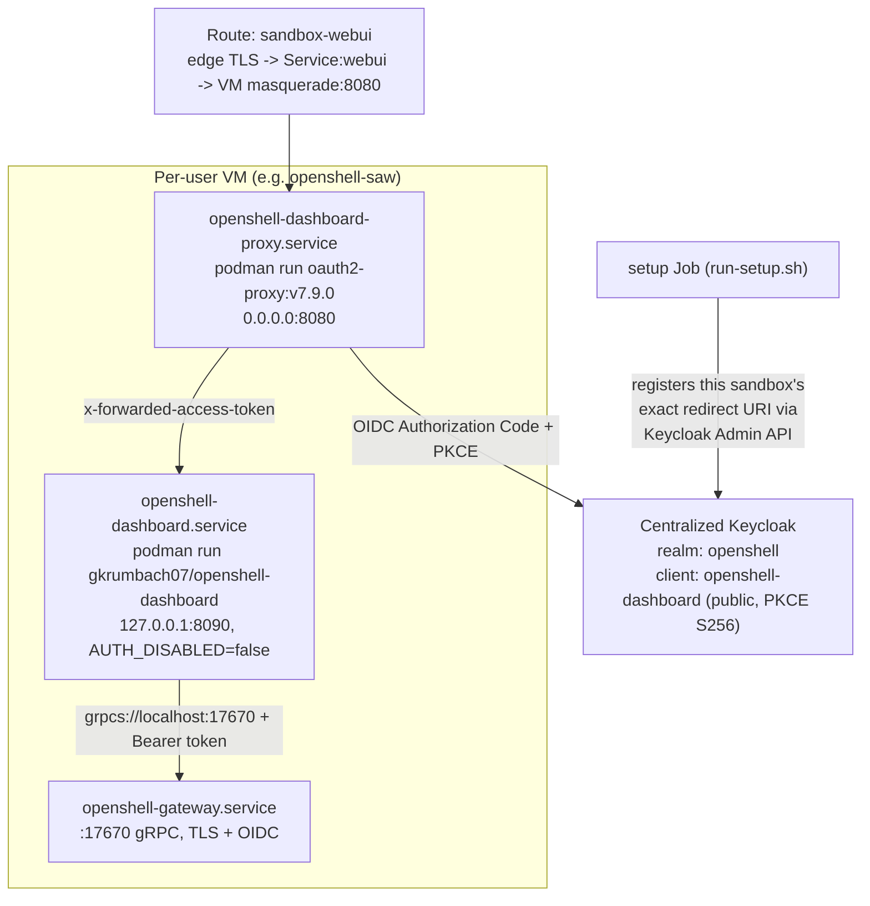

# OpenShell Dashboard Integration

This document describes how the [OpenShell Dashboard](https://github.com/Gkrumbach07/openshell-dashboard)
(a standalone Go BFF + React/PatternFly 6 web admin UI for OpenShell gateways) was integrated into
the Secure Agent Workspace Validated Pattern, why the implementation deviates from the original
ticket in several places, every bug hit during implementation and testing, and how to operate it.

## Summary

Each per-user sandbox VM now optionally runs the OpenShell Dashboard alongside the existing
OpenShell gateway, fronted by [oauth2-proxy](https://oauth2-proxy.github.io/oauth2-proxy/) for real
OIDC Authorization Code + PKCE authentication against the centralized Keycloak, exposed via a new
`<sandbox>-webui` Route (distinct from the existing `<sandbox>-dashboard` Route, which is the
in-sandbox OpenClaw web UI on port 18789 — an unrelated, pre-existing feature with the same name).

This was tested end-to-end on a live OpenShift cluster and confirmed working: hitting the external
Route redirects through oauth2-proxy to the real centralized Keycloak, which serves the actual
"Sign in to OpenShell" login page (`HTTP 200`) with a correctly-registered, sandbox-specific
redirect URI and PKCE challenge — not an error page.

## Architecture



Both the dashboard and oauth2-proxy run as **rootless podman containers**, managed as
`systemctl --user` services for `cloud-user` — the same pattern already used for the sandbox
containers themselves. Nothing was baked into the golden image; everything is delivered and
started by the existing setup Job (`run-setup.sh` → `run-create.sh` → new `setup-dashboard.sh`),
the same SSH-delivery mechanism already used for OIDC tokens and provider credentials.

## Deviations from the original ticket, and why

### 1. The dashboard has no native OIDC — it's proxy-delegated auth

The ticket says *"JWT tokens are validated by the BFF."* Reading the actual dashboard source
(`backend/cmd/server/main.go`, `backend/internal/auth/proxy.go`) shows this is **not** true — the
BFF only reads `AUTH_TOKEN_HEADER` (default `x-forwarded-access-token`) and `AUTH_USER_HEADER`
(default `x-auth-request-user`) from incoming requests and forwards the bearer token to the
gateway. It never talks to Keycloak. The dashboard repo's own root `README.md` is stale on this
point. Real OIDC+PKCE happens in a reverse proxy in front — exactly what the repo's own
`deploy/docker-compose.yml` `auth` profile does with `oauth2-proxy`. Per guidance, we reused that
shape, swapping only its throwaway `keycloak` service for the pattern's already-deployed
`charts/openshell-keycloak`.

### 2. No golden image changes

The ticket's Story 1 asks to "update Dockerfile and golden image." Since `podman` and
`podman.socket` are already available and enabled on every sandbox VM (used for the sandbox
containers themselves), both the dashboard and oauth2-proxy are pulled and run as podman
containers **at setup time**, not baked into the qcow2 image. This avoids an OpenShift `BuildConfig`
rebuild/re-import cycle entirely for this feature.

### 3. New `webui` naming, not `dashboard`

[charts/openshell-saw/templates/route-dashboard.yaml](../charts/openshell-saw/templates/route-dashboard.yaml)
already defines `<sandbox>-dashboard` → port 18789 (the in-sandbox OpenClaw web UI), controlled by
`route.dashboard` in `values.yaml`. The new UI (port 8080) uses `webui` throughout — a new
`route.webui` value, a new `<sandbox>-webui` Route, a new `webui` Service port, and a new VM
masquerade port entry — to avoid clobbering the existing feature.

### 4. Stories 4–6 are out of scope for this repository

Sandbox object-model enrichment (`sandbox.type`/`sandbox.session`/`sandbox.parent` labels), NemoClaw
label propagation, and the dashboard's hierarchy-visualization UI all require changes to **three
separate upstream repositories this pattern doesn't control**: `NVIDIA/OpenShell` (API/object
model), `NVIDIA/NemoClaw` (label propagation), and `Gkrumbach07/openshell-dashboard` (frontend).
The ticket itself acknowledges this needs "coaching the OpenClaw maintainers." Not implemented here
as placeholder code — tracked as future work below.

## Implementation

| Change | File |
|---|---|
| `dashboard.*` values, `route.webui` | [charts/openshell-saw/values.yaml](../charts/openshell-saw/values.yaml) |
| RBAC: `get`/`list` routes (for the webui Route lookup) | [charts/openshell-saw/templates/role.yaml](../charts/openshell-saw/templates/role.yaml) |
| Cross-namespace RBAC: read the Keycloak admin secret | [charts/openshell-saw/templates/rolebinding-keycloak-admin.yaml](../charts/openshell-saw/templates/rolebinding-keycloak-admin.yaml) *(new)* |
| `DASHBOARD_*` env vars for the setup Job | [charts/openshell-saw/templates/secret-setup-env.yaml](../charts/openshell-saw/templates/secret-setup-env.yaml) |
| Webui Route lookup, Keycloak Admin API redirect-URI registration | [charts/openshell-saw/templates/configmap-scripts.yaml](../charts/openshell-saw/templates/configmap-scripts.yaml) (`run-setup.sh`) |
| `setup-dashboard.sh` (new script: writes podman-based systemd units, starts both services) | same file, new ConfigMap key |
| Wiring into `run-create.sh` (chmod, export vars, invoke) | same file |
| `webui` Service port (8080) | [charts/openshell-saw/templates/service.yaml](../charts/openshell-saw/templates/service.yaml) |
| New `<sandbox>-webui` Route | [charts/openshell-saw/templates/route-webui.yaml](../charts/openshell-saw/templates/route-webui.yaml) *(new)* |
| VM masquerade port 8080 | [charts/openshell-saw/templates/virtualmachine.yaml](../charts/openshell-saw/templates/virtualmachine.yaml) |
| New `openshell-dashboard` Keycloak client (public, PKCE S256) | [charts/openshell-keycloak/templates/realm-import.yaml](../charts/openshell-keycloak/templates/realm-import.yaml), [values.yaml](../charts/openshell-keycloak/values.yaml) |

### Hard requirement: OIDC must already be configured on the gateway

The dashboard's gRPC client supports plaintext or server-TLS-with-CA-cert plus a per-RPC bearer
token — but **no mTLS client certificates**. `cloudinit-sandbox.yaml` only disables the gateway's
mTLS requirement (`mtls_auth.enabled = false`) when `oidc.issuerUrl`/`oidc.token` is set. This means
**the dashboard only works when the sandbox is deployed with OIDC configured** — true for both the
Validated Pattern path and the manual path with an explicit `OIDC_ISSUER=...`.

## Bugs found and fixed (in the order encountered)

### 1. `helm upgrade --reuse-values` doesn't pick up new default keys

Enabling the feature on an *existing* release with
`helm upgrade --reuse-values --set dashboard.enabled=true` produced a `dashboard:` map with
**only** `enabled: true` — `image`, `proxyImage`, and `clientId` were missing, even though they
have defaults in `values.yaml`. `--reuse-values` reuses the *previous release's fully-computed
values* as the new baseline and does not re-merge the chart's `values.yaml` defaults for keys that
didn't exist in that prior release at all.
**Fix:** pass every new key explicitly via `--set` (or `helm get values -o yaml`, edit, `-f`) the
first time a brand-new nested value block is introduced to an existing release.

### 2. Setup Jobs are immutable — `helm upgrade` alone won't rerun them

Already known from earlier work on this pattern, and it applies here too: after any values change
or script fix, `oc delete job <sandbox>-setup` is required before `helm upgrade` before a new Job
picks up the change — the old Job (even if `Failed`) is left in place otherwise.

### 3. Rootless podman + SELinux blocks reading the gateway's CA cert

The dashboard container (running as its own non-root user, UID 1001 per its Dockerfile, in a
private rootless user namespace) failed with `read CA cert "/tls/ca.crt": open /tls/ca.crt:
permission denied` even though the bind-mounted file had correct, world-readable POSIX permissions
(`0644`) and every parent directory was traversable. The cluster runs with SELinux `Enforcing`, and
the host file's context (`config_home_t`) isn't accessible to the container's process context.
**Fix:** two parts — (a) copy just the CA cert (public, never the private key) to a dedicated file
rather than bind-mounting the whole TLS directory (avoids exposing the gateway's private key), and
(b) mount it with the `:Z` relabel flag (`-v .../dashboard-gateway-ca.crt:/tls/ca.crt:ro,Z`) so
podman relabels it for the container's SELinux context.

### 4. oauth2-proxy requires a client secret even for PKCE-only public clients

`missing setting: client-secret or client-secret-file` at startup, despite `--code-challenge-method
S256` being set. This is a [known, long-standing oauth2-proxy limitation](https://github.com/oauth2-proxy/oauth2-proxy/issues/2929) —
PKCE is not treated as a substitute for a client secret in oauth2-proxy's config validation, even
though it should be for genuinely public clients.
**Fix:** the documented community workaround — `OAUTH2_PROXY_CLIENT_SECRET_FILE=/dev/null` instead
of an empty `OAUTH2_PROXY_CLIENT_SECRET`. Keycloak's public-client support means no real secret is
ever expected in the token exchange, so this works correctly (some stricter IdPs, e.g. Entra ID,
Ping Federate, do not support this and still require a real secret).

### 5. systemd ordering cycle — dashboard/proxy silently never start on reboot

After a clean VM reboot, both services showed `inactive` despite being `enabled`. The gateway
itself (golden-image-baked `openshell-gateway.service`) has `After=default.target` *combined with*
`WantedBy=default.target` in its own unit file — already a borderline anti-pattern, tolerated only
because nothing else depended on it. Adding `After=openshell-gateway.service` +
`WantedBy=default.target` on the dashboard unit completed a genuine ordering cycle
(`default.target → dashboard → gateway → default.target`); systemd silently **deletes the
dashboard start job** from the boot transaction to break the cycle, with only a terse journal line
(`Found ordering cycle... Job .../start deleted`) — no failure surfaces anywhere else. A first fix
attempt (`WantedBy=openshell-gateway.service` instead of `default.target`) only moved the cycle
onto `openshell-dashboard-proxy.service`, which had the same shape of dependency.
**Fix:** decouple entirely — no explicit `After=`/`Requires=` between the two new units or the
gateway; both use plain `WantedBy=default.target`, relying on `Restart=on-failure` (5s) to self-heal
any startup race (oauth2-proxy tolerates a briefly-unreachable upstream per-request; the dashboard's
gRPC connection to the gateway is likewise retried per-request, not at startup). Verified fixed
with two full VM reboot cycles — both services come up `active` with no cycle warning in the
journal.

### 6. `KeycloakRealmImport` is a one-shot import, not continuous reconciliation

Deploying the updated Keycloak chart (with the new `openshell-dashboard` client) via
`helm upgrade` against an **already-imported** realm did not add the new client — RHBK's
`KeycloakRealmImport` CRD only imports once, at initial realm creation. `KeycloakRealmImport`'s own
`Done: true` condition doesn't distinguish "already done, nothing to do" from "content changed, did
I actually re-import."
**Fix (for an already-deployed realm):** create the client directly via `kcadm.sh create clients
-r openshell -f -` (piped over stdin — `oc cp` doesn't work here since the Keycloak image has no
`tar` binary). For a brand-new deployment, the chart change is picked up correctly on first import.

### 7. VM masquerade port changes require a VMI restart, not just `helm upgrade`

Even after `helm upgrade` updated the `VirtualMachine`'s `spec.template` with the new `webui: 8080`
masquerade port entry, the **running** `VirtualMachineInstance` still only had the old 3 ports —
KubeVirt does not hot-apply interface/port changes to an already-running VMI. The external Route
returned `503` until the VMI was recreated.
**Fix:** `oc delete vmi <sandbox>` (not `vm`) — with `runStrategy: Always`, KubeVirt immediately
recreates the VMI from the current VM template, picking up the new port. The persistent disk/data
is untouched; this is a guest reboot, not a re-provision.

### 8. Keycloak rejects non-trailing wildcard redirect URIs

The initial implementation registered `"https://*/oauth2/callback"` as the client's redirect URI,
intending it to match any of the per-VM sandbox hostnames. Tested live against the real Keycloak
instance: `400 Bad Request`, `"Invalid parameter: redirect_uri"`. Keycloak's redirect URI matching
only supports a wildcard as the **trailing** character of the string — it cannot express "any
hostname, then a fixed path," which is exactly what varying-subdomain-per-VM, fixed-path requires.
**Fix:** replaced the static wildcard entry with dynamic, per-sandbox registration. The setup Job
(`run-setup.sh`) now calls the Keycloak Admin API directly: obtains an admin token via the
`<keycloakName>-initial-admin` Secret (password grant against the `master` realm's `admin-cli`
client), looks up the `openshell-dashboard` client's internal UUID, and does a read-modify-write
(`jq`-based) to append this sandbox's exact `redirectUris`/`webOrigins` entry. Verified live:
after registration, the same external Route now returns the actual Keycloak login page
(`HTTP 200`, `<title>Sign in to OpenShell</title>`) instead of the error page. This requires new
cross-namespace RBAC (`rolebinding-keycloak-admin.yaml`) since Keycloak may live in a different
namespace than the sandbox (a new `dashboard.keycloakNamespace` value; defaults to the sandbox's
own namespace, correct for the co-located Validated Pattern deployment).

### 9. Stray leftover container from manual ad-hoc testing occupied port 8080

While debugging bug #3 above, an ad-hoc `podman run ... quay.io/gkrumbach07/openshell-dashboard
sh -c "cat /tls/ca.crt"` was used to test the CA cert mount in isolation. Since the image's
`ENTRYPOINT` is the dashboard binary itself (no shell), the `sh -c "..."` arguments were passed
*to* the entrypoint as positional args rather than replacing it, so the command actually started a
full dashboard server (on the default port 8080, since `-e PORT` wasn't set in that ad-hoc test)
that kept running in the background — long after the `oc exec` that launched it returned, since
podman containers run under `conmon` independent of the invoking shell. It silently occupied port
8080, causing `openshell-dashboard-proxy.service` to fail with `address already in use` on every
subsequent restart, with no obvious link back to the actual cause.
**Lesson (operational, not a code fix):** always pass `--entrypoint sh` (not just `sh -c ...` as
trailing args) when overriding the command on an image with a fixed `ENTRYPOINT`, and always use
`--rm` *and* run such one-off debugging commands with an explicit timeout/foreground attachment you
can confirm has actually exited.

### 10. oauth2-proxy rejects unverified emails from real SSO accounts

After fixing bug #8, a real browser login (not just `curl`) completed the Keycloak sign-in
successfully but then hit `HTTP 500` at `/oauth2/callback`, with `Error redeeming code during
OAuth2 callback: email in id_token (<user>@redhat.com) isn't verified` in the proxy's log.
oauth2-proxy validates the OIDC `email_verified` claim by default and rejects the login outright if
it's `false`. This is `false` for real, SSO-federated Keycloak accounts (like the one used for all
the live testing in this document) — the realm's manually-created test users (`alice`/`bob`/
`admin`/`developer`) don't hit this since Keycloak marks their email as verified at creation time.
The exact same "real identity vs. built-in test user" friction already documented for the
Keycloak role/workspace bootstrap during the base pattern deployment work.
**Fix:** `OAUTH2_PROXY_INSECURE_OIDC_ALLOW_UNVERIFIED_EMAIL=true` in the proxy's env file. Verified
live: a real browser login that previously 500'd now completes successfully.

### 11. Gateway rejects the dashboard's tokens with `InvalidAudience`

After fixing bug #10, login completed and the dashboard UI shell rendered — but every API call
(`/api/v1/workspaces`, `/api/v1/auth/whoami`, `/api/v1/gateway`) returned `401` and the UI spun
forever. The dashboard's own logs showed the real cause one layer down: `gateway error ...
code=Unauthenticated message="list workspaces: rpc error: code = Unauthenticated desc = invalid
token: InvalidAudience"`. `cloudinit-sandbox.yaml` configures the gateway's OIDC audience check
against a single value — `audience = {{ .Values.oidc.clientId }}`, i.e. `openshell-cli` — since
that was the only client that existed before this integration. Tokens issued to the new
`openshell-dashboard` client carry `aud=openshell-dashboard` instead, which the gateway's
single-audience check rejects outright.
**Fix:** rather than changing the gateway's config (risking breaking the CLI, and unclear whether
the gateway's `oidc.audience` setting even supports a list), added a **second** `oidc-audience-mapper`
protocol mapper on the `openshell-dashboard` client, adding `openshell-cli` as an additional entry
in the access token's `aud` claim (Keycloak supports stacking multiple audience mappers to build up
a multi-value `aud` array). This satisfies the gateway's existing check without touching the
gateway's own configuration at all. Applied live via `kcadm.sh create clients/<id>/protocol-mappers/models`
and persisted in `charts/openshell-keycloak/templates/realm-import.yaml`.

### 12. oauth2-proxy never refreshes the access token — spinner returns a few minutes after login

After fixing bug #11, the dashboard worked fully — briefly. Reloading a few minutes later brought
back the endless spinner. Server-side logs showed `invalid token: ExpiredSignature` this time (not
`InvalidAudience`), and oauth2-proxy's own logs never mentioned attempting a refresh at all.
`--cookie-refresh` (`OAUTH2_PROXY_COOKIE_REFRESH`) **defaults to `0` (disabled)** — oauth2-proxy
does not proactively refresh an expiring access token on its own, it just keeps forwarding the
same stale one from its session cookie until whatever is downstream (the gateway) finally rejects
it. Separately, the initial scope (`openid email profile`) doesn't request `offline_access`, which
is the most reliable way to guarantee Keycloak actually issues a refresh token in the first place.
**Fix:** added `OAUTH2_PROXY_SCOPE=openid email profile offline_access` and
`OAUTH2_PROXY_COOKIE_REFRESH=60s` (safe/frequent — refreshing more often than strictly necessary is
harmless; guessing the exact access-token lifespan and cutting it close is not, per oauth2-proxy's
own docs). **Note:** since the scope itself changed, any session cookie created *before* this fix
was never issued a refresh token with `offline_access` — a fresh login (via `/oauth2/sign_out`) is
required once after deploying this fix for it to take effect.

## Verified end-to-end (live cluster)

- `systemctl --user is-active openshell-dashboard.service` → `active`, survives a full VM reboot.
- `systemctl --user is-active openshell-dashboard-proxy.service` → `active`, survives a full VM reboot.
- `curl http://127.0.0.1:8090/api/v1/healthz` (inside the VM) → `{"status":"ok"}`.
- `curl https://<sandbox>-webui-<ns>.apps.<cluster>/` (external Route) → `302` to the real
  centralized Keycloak, with correct `client_id=openshell-dashboard`, `code_challenge_method=S256`,
  and `redirect_uri` matching this exact sandbox's Route.
- Following that redirect → `200`, `<title>Sign in to OpenShell</title>` — the actual login form,
  not an "Invalid redirect_uri" error page.

## Known pre-existing issue hit during testing (unrelated to this integration)

Repeated VM reboots (`oc delete vmi`) performed while testing the masquerade-port fix (bug #7) left
the sandbox's own nemoclaw/openclaw container in an `Error` phase with `EACCES: permission denied`
errors reading `/sandbox/.openclaw/openclaw.json` on subsequent `openclaw onboard` attempts — even
after deleting and recreating the sandbox object itself. This did not block verifying the dashboard
integration (which only depends on the *gateway*, not the sandbox/agent), but is worth flagging:
**the gateway's sandbox/agent layer does not appear to reliably recover from a VM-level reboot**,
independent of anything in this integration. Worth a separate investigation.

## Operator instructions

### Enable on a new sandbox

```bash
helm upgrade --install <name> charts/openshell-saw -n <namespace> \
  --set dashboard.enabled=true \
  --set route.webui=true \
  --set dashboard.keycloakNamespace=<namespace-where-keycloak-lives>   # omit if co-located (VP default)
```

Requires `oidc.issuerUrl` (or `oidc.token`) to already be set — see "Hard requirement" above.

### Enable on an existing sandbox

Same as above via `helm upgrade --reuse-values`, but **pass every `dashboard.*` key explicitly**
(see bug #1) — do not rely on `--reuse-values` alone to pick up chart defaults for the newly
introduced values block. Then:
```bash
oc delete job <name>-setup -n <namespace>
helm upgrade <name> charts/openshell-saw -n <namespace> --reuse-values
```

### Access the dashboard

```bash
oc get route <name>-webui -n <namespace> -o jsonpath='https://{.spec.host}{"\n"}'
```
Open that URL in a browser — it redirects through oauth2-proxy to the centralized Keycloak login,
then back to the dashboard UI.

### Troubleshoot

```bash
# On the VM (via SSH or virtctl ssh):
systemctl --user status openshell-dashboard.service openshell-dashboard-proxy.service
journalctl --user -u openshell-dashboard.service -u openshell-dashboard-proxy.service -n 50
podman logs openshell-dashboard
podman logs openshell-dashboard-proxy
```

If the external Route 503s: check `oc get vmi <name> -o jsonpath='{.spec.domain.devices.interfaces[0].ports}'`
for the `webui` entry — if missing after a chart upgrade, `oc delete vmi <name>` to force a restart
(see bug #7).

If Keycloak shows "Invalid parameter: redirect_uri": the setup Job's registration step
(`run-setup.sh`) may have failed — check the Job log for `WARNING:` lines around "Registering
redirect URI," and confirm the cross-namespace RBAC (`rolebinding-keycloak-admin.yaml`) was created
in the namespace where Keycloak actually lives.

### Rotate the oauth2-proxy cookie secret

`DASHBOARD_COOKIE_SECRET` is generated fresh (Helm `randAlphaNum 32`) on every `helm upgrade` that
re-renders `secret-setup-env.yaml`. To force rotation without other changes, `oc delete job
<name>-setup` and re-run `helm upgrade --reuse-values`.

## Future work (out of scope here)

- Sandbox object model enrichment (`sandbox.type`/`sandbox.session`/`sandbox.parent` labels) —
  requires upstream `NVIDIA/OpenShell` API changes.
- NemoClaw label propagation for the above — requires upstream `NVIDIA/NemoClaw` changes.
- Dashboard hierarchy-visualization UI consuming the above metadata — requires upstream
  `Gkrumbach07/openshell-dashboard` frontend changes.
- Investigate the sandbox-doesn't-survive-VM-reboot issue noted above.
- Consider whether the per-sandbox Keycloak Admin API registration should also *remove* the
  redirect URI on `helm uninstall`/sandbox deletion, to avoid the client's `redirectUris` list
  growing unboundedly across many created-and-deleted sandboxes over time.
