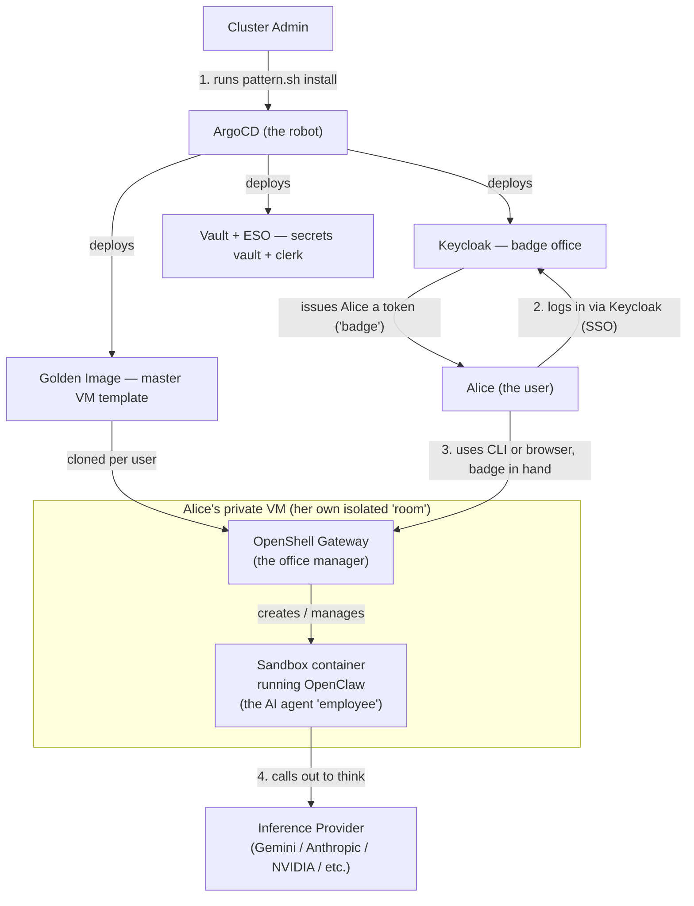

# Secure Agent Workspace — Explained From Zero

*A plain-English guide to the whole project, for the manager meeting. No prior technical
knowledge assumed. Read top to bottom, or jump straight to [Part 6](#part-6-what-the-dashboard-task-actually-asked-for) if you only need the dashboard story.*

---

## TL;DR (read this if you only have 2 minutes)

- We run AI coding agents (think: an AI that can actually type commands and edit files, not
just chat) **safely** by giving every person their own private virtual computer, so if the AI
does something wrong, it's contained to that one computer and nothing else.
- Logging in works like a company badge system (Keycloak): one login, works everywhere, and it's
centrally controlled so IT can revoke access instantly.
- Our specific task: take a **pre-built website (dashboard)** — made by another engineer — that
lets you *see and click around* your AI agents instead of only typing commands, and wire it
safely into this system, using the same badge system everyone already logs in with.
- **Result: done and verified working on a real cluster.** People can open a web page, log in
with their normal company-style login, and see their AI agent's status.
- A **follow-up piece** (making the dashboard show a "family tree" of which sub-tasks an agent
spawned) is **not done** — it needs code changes in three other teams' projects that we don't
own, so it's logged as future work, not something we could finish in this task.

---

## Part 1: What problem is this whole project solving?

Imagine you want to give every employee an AI assistant that can actually *do* things for
them — run code, edit files, call company systems — not just answer questions in a chat box.

That's powerful, but also risky: if the AI is confused, or someone tricks it, or it just makes a
mistake, it could do that on **your real computer**, with **your real access**. That's like
giving a brand-new, occasionally-erratic contractor a master key to the whole building.

**The fix, conceptually, is very simple:** give every person's AI agent its own private, isolated
"room" — a computer that only that one person's agent uses. If something goes wrong in that
room, it stays in that room. Nothing else in the company is touched.

This project, **Secure Agent Workspace**, is Red Hat's implementation (on OpenShift, our
enterprise Kubernetes platform) of exactly that idea, following a reference design published by
NVIDIA. Concretely: **one private virtual computer per user**, with an AI agent living inside it,
wrapped in the same company login system everyone already uses.

---

## Part 2: The absolute basics (no jargon left unexplained)

Skip this section if you're already comfortable with these words — otherwise, read it once and
everything after this will make sense.

### "Server" and "Cluster"

A **server** is just a computer that's always on, sitting in a data center, doing work for other
computers. A **cluster** is a group of servers wired together and managed as if they were one
giant computer. **OpenShift** is the software that turns a pile of physical servers into a
cluster and lets us run many separate applications on it safely, side by side.

### "Virtual Machine" (VM)

A VM is **a fake computer that lives inside a real computer.** Software (a "hypervisor") slices
up one real server's CPU/memory/disk and pretends to give a full, separate computer to each
slice — complete with its own operating system, as if it were a totally independent machine, even
though several VMs might be running on the same physical box. **OpenShift Virtualization**
(built on an open-source technology called **KubeVirt**) is the part of OpenShift that lets us
create and manage these VMs.

Why do we use a full VM instead of something lighter? Because a VM is the *strongest* kind of
isolation available — it's as if that AI agent has its own physical computer. That matters a lot
when the thing running inside it is an AI that executes arbitrary code.

### "Container"

A container is a **lighter-weight box for running one application**, packaged with everything it
needs (code, libraries, settings) so it runs identically anywhere. Think of a shipping
container: standardized, portable, and it doesn't matter what ship (server) carries it. Containers
are faster to start and cheaper to run than full VMs, but they share the host computer's core
operating system, so the isolation is weaker than a VM's. **Podman** is the tool we use (instead
of the more famous "Docker") to create and run containers — it's Red Hat's container engine, and
it can run without special admin privileges ("rootless"), which is safer.

In this project we use **both**: a full VM per person (strong isolation, the "room"), and then,
*inside* that VM, lightweight containers (via podman) for the actual pieces of software that need
to run (the AI agent itself, the dashboard, etc.) — because once you're already inside your own
private VM, container-level isolation between your own processes is enough.

### GitOps, ArgoCD, and "Validated Pattern"

Instead of an engineer manually clicking buttons or running commands on the live cluster to set
things up, we write down **what we want the cluster to look like** as files in a Git repository
(the same kind of tool used for source code, with full history and review). A robot called
**ArgoCD** constantly watches that Git repository and automatically makes the real cluster match
it. If someone manually changes something on the cluster, ArgoCD notices and puts it back the way
Git says it should be. This is called **GitOps** — "Git is the source of truth."

A **"Validated Pattern"** is Red Hat's packaging of this idea: a ready-made recipe (this
repository) that, when pointed at a blank OpenShift cluster, uses ArgoCD to install *everything*
needed for the whole solution automatically — no manual clicking required.

### Helm charts and `values.yaml`

A **Helm chart** is a template for a piece of software that runs on Kubernetes/OpenShift — like a
recipe with blanks to fill in (how much memory, which image, what settings). The `values.yaml`
file is where you fill in those blanks for your specific situation. This project has several
charts, one per major piece (Keycloak, the per-user VM, secrets, etc.).

### "Route" and "Service" (how you reach something from a browser)

Things running inside the cluster aren't reachable from the internet by default — that's a
safety feature. A **Service** gives something a stable address *inside* the cluster. A **Route**
is what OpenShift uses to expose that Service to the outside world with a real web address (URL)
and HTTPS encryption, so you can open it in your laptop's browser.

### APIs: gRPC vs REST (how programs talk to each other)

Both are just "languages" programs use to ask each other to do things over a network.
**REST** (used by most websites/backends) is simple, text-based (JSON), and what a browser
naturally speaks. **gRPC** is a faster, more structured, binary protocol, often used for
program-to-program communication where performance and strict contracts matter — like our
AI-agent gateway. You don't need to memorize the difference; just know: "the gateway speaks
gRPC, browsers speak REST, so something in between has to translate."

### OIDC, SSO, and Keycloak (the "company badge" system)

**OIDC** (OpenID Connect) is a standard way for one central system to prove "yes, this really is
the person they claim to be" to many different applications, without each application having to
manage its own passwords. This is the same idea as **SSO** (Single Sign-On) — log in once,
and that login works everywhere it's trusted.

**Keycloak** (we specifically use **Red Hat Build of Keycloak**, "RHBK") is the software that
*is* the central login system — the "badge office." When you log into any app that trusts
Keycloak, you're redirected to Keycloak's own login page, you prove who you are there, and
Keycloak hands your browser a signed, time-limited digital "badge" (called a **token**) that
proves your identity. The app never sees your password — it only ever sees the badge.

A "**realm**" in Keycloak is just a named, self-contained set of users/apps/settings (like a
specific company's whole badge system). A "**client**" is one specific application registered to
accept Keycloak badges (e.g., our CLI is one client, our new dashboard is another).

### RBAC (who's allowed to do what)

**RBAC** (Role-Based Access Control) just means: users get assigned **roles** (e.g.
`openshell-user`, `openshell-admin`), and the system checks a user's roles before letting them do
something. It's the digital equivalent of "your badge only opens the doors your job requires."

### Secrets, Vault, and the External Secrets Operator (ESO)

A **secret** is any sensitive value — an API key, a password, a private key — that must never be
visible in plain text in Git or configuration files. **HashiCorp Vault** is a secure vault
(literally, think of a bank vault) that stores these values properly encrypted. The **External
Secrets Operator (ESO)** is the "delivery clerk" that fetches specific secrets from Vault and
places them into the cluster, in the exact spot where they're needed, right before they're used —
so the actual API keys never have to be written down in our Git repository at all.

### The "Golden Image"

Rather than manually installing software on every single VM we create, we build **one perfect,
fully-configured template disk image once** (with all the software already installed and
pre-configured) — this is the **golden image**. Every new user's VM is then created as an
instant copy of that template, which is dramatically faster and more consistent than installing
everything from scratch each time. Think of it as a "master photocopy master" — you make the
master once, carefully, and then every copy from it is identical and instant.

---

## Part 3: The cast of characters in THIS specific project

Now that the general vocabulary is covered, here's exactly which named tools/technologies play
which role in Secure Agent Workspace.

| Name                                                                    | What it actually is                                                      | Plain-English role                                                                                                                                                     |
| ----------------------------------------------------------------------- | ------------------------------------------------------------------------ | ---------------------------------------------------------------------------------------------------------------------------------------------------------------------- |
| **OpenShift**                                                           | Red Hat's enterprise Kubernetes platform                                 | The "building" — the whole cluster everything runs inside                                                                                                              |
| **OpenShift Virtualization (KubeVirt)**                                 | The part of OpenShift that runs VMs                                      | Lets the building host a private "room" (VM) for each person                                                                                                           |
| **Red Hat Build of Keycloak (RHBK)**                                    | Our deployed identity/login server                                       | The company "badge office" — one login for everything                                                                                                                  |
| **HashiCorp Vault**                                                     | The secrets vault                                                        | The literal bank vault for API keys and SSH keys                                                                                                                       |
| **External Secrets Operator (ESO)**                                     | Syncs Vault secrets into the cluster                                     | The clerk who fetches the right key from the vault at the right moment                                                                                                 |
| **ArgoCD / Validated Pattern**                                          | GitOps automation                                                        | The robot that builds/maintains everything per the Git blueprint                                                                                                       |
| **The Golden Image (bootc pipeline)**                                   | A pre-built Fedora Linux disk image                                      | The "master copy" every user's VM is instantly cloned from                                                                                                             |
| **OpenShell** ([NVIDIA/OpenShell](https://github.com/NVIDIA/OpenShell)) | A CLI + "Gateway" program                                                | The **office manager** living inside each VM — handles login, lets you create/manage your AI agent's workspace ("sandbox"), and proxies your SSH/terminal connections  |
| **OpenShell Gateway**                                                   | The server half of OpenShell, running as a background service in each VM | Answers requests (over gRPC) for "create a sandbox," "list my sandboxes," "let me SSH in," etc. It's the one thing every other tool (CLI, dashboard) actually talks to |
| **NemoClaw** ([NVIDIA/NemoClaw](https://github.com/NVIDIA/NemoClaw))    | The open-source project that builds the AI agent's container image       | The "factory" that produces the actual AI-agent software package                                                                                                       |
| **OpenClaw**                                                            | The command/program name that NemoClaw's image runs inside each sandbox  | The **actual AI agent "employee"** — this is the program that reads your instructions, thinks (by calling an LLM), and executes commands/edits files on your behalf    |
| **Sandbox**                                                             | A podman container, created on-demand inside your VM, running OpenClaw   | Your **individual task/workspace** — you can have more than one, each isolated from the others even though they're in the same VM                                      |
| **Inference Provider**                                                  | An external AI/LLM API — Gemini, Anthropic, OpenAI, NVIDIA Build, etc.   | The actual "brain" OpenClaw calls out to whenever it needs to think/generate a response                                                                                |
| **Quay.io**                                                             | A container image registry (like an app store/warehouse)                 | Where finished, ready-to-run software images are stored and pulled from                                                                                                |
| **OpenShell Dashboard**                                                 | The new piece we integrated — a standalone website                       | A visual, point-and-click alternative to typing CLI commands                                                                                                           |
| **oauth2-proxy**                                                        | A small, well-known open-source "bouncer" program                        | Sits in front of an app with no login of its own and makes it check Keycloak badges before letting anyone in                                                           |

**A quick note on naming, because it trips everyone up:** "OpenShell" is the project that gives
us the *gateway/CLI* (the office manager). "NemoClaw" is the project that builds the *sandbox
container image*, and inside that container, the program you actually interact with is called
`openclaw` — similar-sounding, different job. OpenShell manages the "rooms and doors"; OpenClaw is
the "employee" working inside one specific room.

---

## Part 4: How it all fits together — the end-to-end journey

Step by step, in plain words:

1. **A cluster admin installs the pattern once.** ArgoCD (the robot) reads the Git repository and
  automatically installs Keycloak, Vault, the VM-hosting capability, and everything else needed.
2. **A private VM is created for each user**, instantly cloned from the golden image (master
  template) — no need to install software from scratch each time.
3. **The user logs in through Keycloak** (the badge office) — same login experience as any other
  company app with SSO.
4. **The user's badge (token) lets them talk to their own VM's OpenShell Gateway** — either via a
  command-line tool, or (with our new work) via a website.
5. **Inside the VM, the gateway creates "sandboxes" on request** — each sandbox is a container
  running OpenClaw, the actual AI agent.
6. **OpenClaw does the actual work** — reading instructions, running commands, editing files —
  and whenever it needs to "think," it calls out to an external AI brain (the inference
   provider, e.g. NVIDIA's or Anthropic's API), using the API key the user configured.

Everything is locked down so **only Alice can ever reach Alice's VM** — enforced both by the
Keycloak login and by network-level access rules.

---

## Part 5: What the dashboard task actually asked for

Up to this point, the *only* way to interact with your sandbox was a command-line tool (typing
commands like `openshell sandbox list`). That works, but it's not friendly for:

- People who aren't comfortable with a terminal
- Getting a quick visual overview when you have several sandboxes running
- Demoing the system to someone non-technical

**The ask:** integrate a **pre-built website** (built by another engineer, not something we had
to write ourselves) that shows your gateways, workspaces, sandboxes, and AI-provider credentials
in a browser, with clickable buttons instead of typed commands — into this system, running one
instance per user's VM, secured by the same Keycloak login everyone already uses.

There was also a *second*, more ambitious part of the ask: make the dashboard smart enough to
show a **family tree** of an agent's work — e.g., "the main agent spawned this sub-task, which
spawned this tool call" — visually, like an org chart.

---

## Part 6: What we actually built, in plain English

Think of it like hiring a new **receptionist** for each person's private office (VM), who sits at
a nice-looking front desk (the website) instead of making everyone talk through a walkie-talkie
(the CLI).

1. **We added the receptionist (the dashboard app) to every VM**, running right alongside the
  existing office manager (the OpenShell Gateway). We didn't have to build the receptionist from
   scratch — someone else already built this pre-packaged program; our job was to actually employ
   her: get her a desk, plug her into the phone system, and make sure only the right people can
   walk up to her.
2. **We discovered the receptionist has no ID-checking training of her own** — she'll happily
  talk to anyone who hands her a note that *looks* official. That's actually fine, because the
   plan was always to put a **bouncer** at the front door first. We used a well-known,
   battle-tested bouncer program called `oauth2-proxy`: nobody reaches the receptionist without
   the bouncer first sending them to the badge office (Keycloak), checking their badge, and only
   then letting them through — and forwarding a note to the receptionist saying who it is.
3. **We told the badge office (Keycloak) about this new front desk.** Keycloak had already been
  configured to recognize the command-line tool as one "application," and we registered the
   dashboard as a *second*, separate application it also trusts and can issue badges for.
4. **We opened a brand-new, dedicated front door (a web address / Route)** for the receptionist,
  separate from an older, unrelated door that already existed for a completely different
   feature (a legacy chat-only web view built into the AI agent itself, not part of this project).
5. **Because every person's VM has its own unique street address**, and Keycloak (the badge
  office) is strict about only allowing badges to be used at *exactly* the door address it was
   told about in advance, we made the system **automatically tell Keycloak the new VM's exact
   address** every single time a new VM/sandbox is created — no manual step required.

**End result, tested on a real, live OpenShift cluster:** you open your sandbox's dashboard web
address in a browser, you're sent to the real company login page, you log in, and you land on a
working dashboard showing your gateway's live status — with nothing about it feeling different
from logging into any other normal company web app.

### What we deliberately did *differently* from the original plan, and why

- **The ticket said "update the Dockerfile and golden image"** (i.e., bake the receptionist into
the master template used for every VM). **We didn't do that.** Since every VM already comes
with the ability to download and run small packaged programs on demand (the same mechanism
already used to run the AI agent itself), we just have the VM download and start the
receptionist program the moment it's switched on, instead of permanently building her into the
master blueprint. Net effect for the user: identical. Net effect for us: we avoid a much slower,
heavier "rebuild the entire master template" process for this one feature.
- **The ticket assumed the receptionist could check IDs herself.** She can't — we verified this by
actually reading her source code. So we added the bouncer (`oauth2-proxy`) in front, which is
in fact exactly what the receptionist's own creator recommends doing, just with our own
existing badge office instead of a temporary placeholder one.

### What was NOT done, and why

The "family tree" visualization (showing an agent's sub-tasks and tool calls as a tree) was
**not implemented**. That's not an oversight — it genuinely requires code changes in **three
separate projects we don't own**: NVIDIA's OpenShell project (to even record "this sandbox is a
sub-task of that one"), NVIDIA's NemoClaw project (to have OpenClaw report that relationship), and
the dashboard's own project (to draw the tree on screen). None of that data exists today anywhere
in the system for the dashboard to display, no matter what we changed on our side. This is
clearly logged as future work requiring collaboration with those other teams.

---

## Part 7: The bumps along the way (in plain English)

We hit and fixed **14 real, concrete problems** while actually testing this on a live cluster
(not just in theory) — that's normal and expected for this kind of integration work. Here they
are, translated out of jargon:

1. **Turning the feature on for an already-running setup didn't fully work.** Our deployment tool
  (Helm) has a quirk where, if you flip on a brand-new feature for something that's already
   running, it forgets to also apply that feature's other default settings. Fix: state every
   setting explicitly the first time.
2. **A one-time setup step doesn't automatically re-run when we change it.** Had to manually tell
  it to re-run after every fix during testing — a known, existing quirk of this system, not new.
3. **The receptionist wasn't allowed to read a security certificate file** due to a strict
  Linux security feature (SELinux) treating her as an untrusted stranger even though the file
   permissions looked fine. Fix: gave her a copy of just the public certificate, properly labeled
   for her to read.
4. **The bouncer program refused to start** because it insisted on a "shared secret" password
  even though our login method doesn't need one (a known limitation of that bouncer software).
   Fix: used the documented workaround.
5. **The receptionist and bouncer silently failed to start on a computer restart** — because of a
  subtle circular "wait for each other" instruction that caused the startup system to just quietly
   cancel their start-up, with barely a trace in the logs. Fix: removed the circular dependency,
   let each one just retry on its own if it briefly can't reach the other.
6. **The badge office doesn't automatically notice new registrations on an already-set-up
  system** — it only reads its full configuration once, at first-time setup. Fix: for
   already-running systems, register the new application directly; brand-new systems pick it up
   automatically.
7. **Changing the VM's network settings required an actual restart to take effect** — updating
  the "blueprint" isn't enough if the VM is already running; had to restart it once.
8. **The badge office rejected our first attempt at a "any address works" door registration** —
  it turns out it only allows a wildcard at the very end of an address, and we needed one in the
   middle. Fix: instead of one flexible rule, automatically register each VM's *exact* address
   the moment it's created.
9. **A leftover test program from earlier debugging was secretly still running** and blocking the
  real receptionist from using the same door. Purely an operational cleanup lesson, not a code
   bug.
10. **The badge office refused logins from real employee accounts** (but not from the built-in
  test accounts) because of a stricter email-verification check that real company accounts don't
    satisfy by default. Fix: relaxed that one specific check, which is safe here because Keycloak
    itself already verified the person's identity through the company's real login system.
11. **The office manager (gateway) rejected the receptionist's badges** because it was only
  told to trust badges meant for the CLI tool, not badges meant for the dashboard. Fix: made
    Keycloak stamp *both* names onto the dashboard's badges, satisfying the existing check without
    touching the gateway's own configuration at all.
12. **Logins silently expired after just a few minutes**, bringing back an endless loading spinner,
  because the bouncer wasn't set up to request a "renewal ticket" or actually use one. Fix:
    requested the renewal ticket and turned on automatic renewal.
13. **A specific type of "extended" renewal ticket broke logins for real employee accounts** —
  this is the one your manager filed a ticket about. The bouncer was asking Keycloak for a special
    kind of renewal ticket meant for apps that need to work even after you've logged out entirely.
    Keycloak will only hand that out to accounts specifically flagged for it — the built-in test
    accounts happen to be flagged, real employee accounts aren't, by default. So real logins broke
    with a different error than bug #12's. Turns out that special ticket was never actually needed
    in the first place — the *regular* renewal ticket (which every account gets automatically)
    already does the job just fine. Fix: stopped asking for the special one entirely, which fixes
    it for every current and future person, not just the one account that hit it.
14. **One failed, non-essential step could take down the entire setup process.** A small piece of
  the setup script (extracting a token only used by an old, secondary feature) had no
    "if this fails, just move on" instruction — so on the rare occasion that one small step
    failed, it accidentally stopped everything else after it, including the dashboard install
    itself. Fix: added the missing "move on if this fails" instruction, matching the same pattern
    already used one line above it.

Every one of these is written up in full technical detail, with exact error messages and the
exact fix applied, in `[docs/openshell-dashboard-integration.md](openshell-dashboard-integration.md)` —
this document is the simplified version for a conversation, that one is the engineering record.

---

## Part 8: Status summary

| What was asked                                     | Status                                                                                      |
| -------------------------------------------------- | ------------------------------------------------------------------------------------------- |
| A pre-built dashboard website, one per user's VM   | ✅ Done, tested live                                                                         |
| Real company login (Keycloak/SSO) on the dashboard | ✅ Done, tested live                                                                         |
| A dedicated, working web address for it            | ✅ Done, tested live                                                                         |
| Survives a computer restart                        | ✅ Done, verified with two full reboot tests                                                 |
| "Family tree" view of agent sub-tasks              | ❌ Not done — needs changes in three other teams' codebases                                  |
| Update the master VM template specifically         | ⚠️ Done differently (on-demand download instead), same end result, documented and explained |

**One important caveat for the meeting:** this feature is currently **opt-in, off by default**.
An operator has to explicitly turn it on per sandbox (one flag) — it doesn't automatically appear
for every existing or new user just because the code exists. That was a deliberate, safe choice
so we don't change behavior for anyone not asking for it.

---

## Part 9: Quick talking points for the meeting

- **"What did we deliver?"** — A working, securely-authenticated web dashboard for the AI agent
workspace, using the same company login as everything else, tested end-to-end on a real
cluster.
- **"Did we build the dashboard itself?"** — No, that was pre-built by another engineer
(Gkrumbach07/openshell-dashboard). Our job was the integration: authentication, networking, and
making it work safely inside our existing per-user VM system.
- **"Why didn't we bake it into the master image like the ticket said?"** — Because the VMs
already have everything needed to just download and run it on the spot, which is faster and
avoids a slow, heavy rebuild process — same end result for the user.
- **"What's left?"** — The visual "family tree" of sub-tasks. It needs upstream changes in two
NVIDIA-owned open-source projects plus the dashboard project itself — none of that data exists
in the system today, so it's a cross-team follow-up, not something blocked on us.
- **"Is it production-ready?"** — Functionally yes and verified live; it's currently opt-in
(off by default) so it can be rolled out deliberately rather than automatically to everyone.
- **"What about the ticket I filed?"** — That's bug #13 above. Already root-caused, fixed, and
verified live on two separate sandboxes before this meeting — nothing left open on that front.

---

## Glossary (quick A–Z reference)

| Term                                | Meaning                                                                         |
| ----------------------------------- | ------------------------------------------------------------------------------- |
| ArgoCD                              | The automation robot that keeps the cluster matching what's written in Git      |
| Cluster                             | A group of servers managed as one big computer                                  |
| Container                           | A lightweight, portable box for running one application                         |
| ESO (External Secrets Operator)     | Fetches secrets from Vault into the cluster automatically                       |
| GitOps                              | Managing infrastructure by describing it in Git and letting automation apply it |
| Golden image                        | The pre-built master template every VM is instantly cloned from                 |
| gRPC                                | A fast, structured way for programs to talk to each other (used by the gateway) |
| Helm chart                          | A template/recipe for deploying software on Kubernetes/OpenShift                |
| Keycloak (RHBK)                     | The centralized login/identity system ("badge office")                          |
| KubeVirt / OpenShift Virtualization | The technology that runs VMs on top of OpenShift                                |
| NemoClaw                            | The open-source project that builds the AI agent's container image              |
| OIDC                                | The standard protocol behind single sign-on logins                              |
| oauth2-proxy                        | The "bouncer" program that adds login-checking to an app that has none          |
| OpenClaw                            | The actual AI agent program that runs inside a sandbox                          |
| OpenShell                           | The CLI + Gateway project that manages sandboxes/VMs                            |
| OpenShift                           | Red Hat's enterprise Kubernetes platform ("the building")                       |
| Podman                              | Red Hat's tool for running containers, without needing admin privileges         |
| RBAC                                | Role-based permissions — who's allowed to do what                               |
| Route                               | A public web address pointing into the cluster                                  |
| Sandbox                             | An individual container, running OpenClaw, inside a user's VM                   |
| Secret                              | Any sensitive value (API key, password) that must be securely stored            |
| Service                             | A stable internal address for something running in the cluster                  |
| SSO                                 | Single Sign-On — log in once, works everywhere                                  |
| Token                               | A signed, temporary digital "badge" proving who you are                         |
| Validated Pattern                   | Red Hat's packaged, automated recipe for deploying a whole solution             |
| Vault                               | The secure storage system for API keys and other secrets                        |
| VM (Virtual Machine)                | A "fake," fully isolated computer running inside a real one                     |

