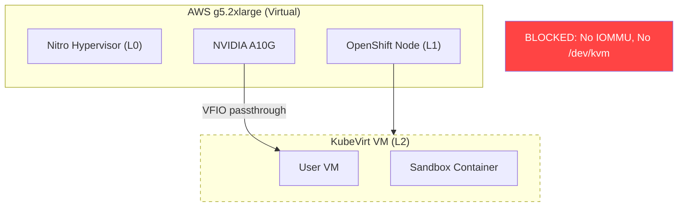
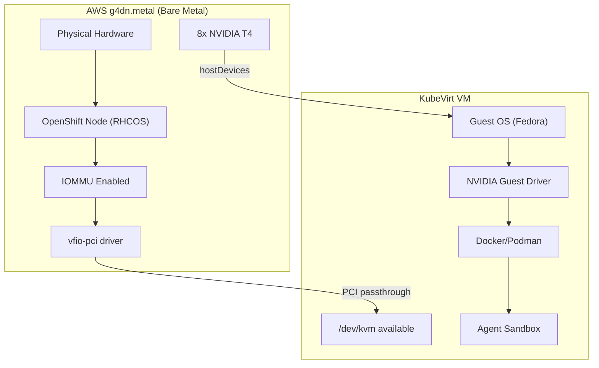

# Nested Virtualization as Alternative to Bare-Metal for GPU Passthrough

## TL;DR

Nested virtualization on AWS **solves the VM-booting problem** (KubeVirt VMs can boot with real KVM acceleration instead of software emulation) but **does not solve GPU passthrough** (which requires IOMMU — something AWS nested virt does not expose). Additionally, no GPU instance type supports nested virtualization, and no nested-virt-capable instance has GPUs. The two capabilities are mutually exclusive on AWS today.

The fastest path to GPU-accelerated agent sandboxes is a **hybrid architecture**: nested-virt nodes for the VM workloads + container-level GPU access via the NVIDIA device plugin on existing g5 nodes. The definitive path to validate the full three-layer passthrough (GPU → Node → VM → Container) requires `g4dn.metal` (the only x86_64 bare-metal GPU instance on AWS).

---

## Context

[PR #37](https://github.com/validatedpatterns-sandbox/secure-agent-workspace/pull/37) (`gpu-task` branch) implements GPU passthrough through three layers:

```
Physical GPU → OpenShift Node → KubeVirt VM → Docker Container → Sandbox Process
```

The code/config wiring is complete and gated by `vm.gpu.enabled: false`. What's missing is live validation on hardware that supports VFIO passthrough. The current test cluster uses AWS `g5.2xlarge` instances which are virtual (not bare-metal) — confirmed live:

- No `/dev/kvm` (Nitro hypervisor doesn't expose it on standard instances)
- No `svm`/`vmx` CPU flags
- No IOMMU groups (`/sys/kernel/iommu_groups/` empty)

This means KubeVirt `hostDevices` (VFIO PCI passthrough) into a nested VM is physically impossible on these nodes.

**The question from jjaggars:** Could we add a nodepool with nested-virt-enabled instances, configure them, and use that as a workaround?

---

## Answer: What Nested Virt Would and Would Not Solve

| Problem | Nested Virt Solves? | Explanation |
|---|---|---|
| KubeVirt VMs won't boot (no `/dev/kvm`) | **YES** | Nitro exposes VT-x; `/dev/kvm` becomes available |
| `useEmulation: true` hack required | **YES** | Real KVM acceleration removes need for software emulation |
| GPU passthrough to VMs (VFIO/hostDevices) | **NO** | No IOMMU exposed to L1 guest, no PCIe passthrough to L2 |
| End-to-end GPU inside sandbox VM | **NO** | No path to deliver a physical GPU into a nested VM |

---

## Detailed Findings

### 1. AWS Nested Virtualization Does Not Expose IOMMU

The Nitro System passes **only processor extensions** (Intel VT-x) to the L1 guest instance. It does not virtualize or expose:
- IOMMU / VT-d (required for VFIO device isolation)
- PCIe device passthrough
- SR-IOV virtual functions

AWS documentation explicitly limits use cases to software that needs CPU-level virtualization: KVM/Hyper-V hypervisors, Docker Desktop, WSL2, Android emulators, in-vehicle hardware simulation.

**Sources:**
- [AWS Nested Virtualization Documentation](https://docs.aws.amazon.com/AWSEC2/latest/UserGuide/amazon-ec2-nested-virtualization.html)
- [InfoQ: AWS Introduces Nested Virtualization on EC2 Instances (Mar 2026)](https://www.infoq.com/news/2026/03/aws-ec2-nested-virtualization/)
- [AWS What's New: Nested virt on additional Intel platforms (Jun 2026)](https://aws.amazon.com/about-aws/whats-new/2026/06/nested-virtualization-intel-us-gov-cloud/)

### 2. GPU Instance Types Do Not Support Nested Virtualization

**Supported nested-virt types (as of June 2026):**
C8i, M8i, R8i, C8id, R8id, M8id, C8i-flex, R8i-flex, M8i-flex, X8i, C7i, R7i, M7i, C7i-flex, M7i-flex, I7i

**Not supported:** All GPU families (G4, G5, G6, G7e), all training/inference families (P4, P5, P6, Trn, Inf), and all Graviton instances.

There is **zero overlap** between GPU-capable and nested-virt-capable instance types. You cannot get both on a single node.

### 3. Bare-Metal GPU Instances on AWS

Only two bare-metal GPU options exist as of August 2026:

| Instance | GPUs | Arch | VRAM | vCPUs | RAM | Cost/hr |
|---|---|---|---|---|---|---|
| `g4dn.metal` | 8x NVIDIA T4 | x86_64 (Intel Xeon) | 128 GiB | 96 | 384 GiB | ~$7.82-9.39 |
| `g5g.metal` | 2x NVIDIA T4G | ARM64 (Graviton2) | 32 GiB | 64 | 128 GiB | ~$2.74 |

- There is no `g5.metal`, `g6.metal`, `p4d.metal`, or `p5.metal`
- `g4dn.metal` is the **only x86_64 bare-metal GPU instance** on AWS
- `g5g.metal` is ARM64 — incompatible with our x86_64 workloads

### 4. IOMMU on Bare-Metal EC2 — Status

Enabling `intel_iommu=on` on bare-metal EC2 instances has a mixed track record:

- **DPDK documentation** confirms that x86_64 metal instances (i3.metal, c5.metal) support IOMMU when enabled via GRUB kernel parameter
- **2021-2022 reports** on AWS re:Post and Hacker News describe instances hanging/becoming unreachable after enabling IOMMU — likely older Nitro firmware
- **2024+ guide** (i4i.metal with Seastar NVMe driver) demonstrates IOMMU + VFIO working successfully
- **g4dn.metal** (Nitro v3, Intel Xeon) should support IOMMU based on architecture, but no published GPU-passthrough-to-VM success report exists for this specific instance type on AWS
- **Unsafe NOIOMMU mode** (`enable_unsafe_noiommu_mode`) is a documented workaround for DPDK use cases but provides no device isolation — unsuitable for multi-tenant VM workloads

**Bottom line:** IOMMU on `g4dn.metal` is architecturally plausible but unproven for our specific use case. A time-boxed spike (add the node, enable IOMMU, check if it boots and exposes IOMMU groups) would cost ~$8/hr and answer the question definitively.

**Sources:**
- [AWS re:Post: PCIe device passthrough on bare-metal EC2](https://repost.aws/questions/QU15BJU3JUTQaoIQmXKSEdag/pcie-device-passthrough-on-bare-metal-ec2-instances)
- [DPDK ENA VFIO patch docs](https://github.com/amzn/amzn-drivers/tree/master/userspace/dpdk/enav2-vfio-patch)
- [HN: Anybody enabled IOMMU on AWS metal servers?](https://news.ycombinator.com/item?id=29008194)

### 5. OpenShift MachineSet — Nested Virt Is Already Wired

The `NestedVirtualization` field exists in `openshift/cluster-api-provider-aws` (v1beta2 API):

- [Upstream PR #5874](https://github.com/kubernetes-sigs/cluster-api-provider-aws/pull/5874) — merged April 1, 2026
- [Commit e227373](https://github.com/openshift/cluster-api-provider-aws/commit/e2273735ebc61ed4b65db9a331ee6542e15a50e4)
- Wired through to `EC2 RunInstances` via `CpuOptionsRequest.NestedVirtualization`

### 6. NVIDIA GPU Operator + KubeVirt Requirements

From [NVIDIA GPU Operator documentation (26.3)](https://docs.nvidia.com/datacenter/cloud-native/openshift/26.3/openshift-virtualization.html):

> "Worker nodes running GPU accelerated VMs (with pGPU or vGPU) are **assumed to be bare metal**."

The full requirements for GPU passthrough into KubeVirt VMs:
1. Bare-metal node with physical GPU
2. IOMMU enabled (`intel_iommu=on` kernel arg via MachineConfig)
3. GPU bound to `vfio-pci` driver (not the nvidia host driver)
4. NVIDIA GPU Operator deployed with node label `nvidia.com/gpu.workload.config=vm-passthrough`
5. GPU listed in `HyperConverged.spec.permittedHostDevices.pciHostDevices`
6. VM spec references the device via `spec.domain.devices.gpus` or `hostDevices`

---

## Options for Moving Forward

### Option A: `g4dn.metal` Nodepool (Full Stack Validation on AWS)

Add a `g4dn.metal` worker MachineSet to the existing cluster. This gives true bare-metal with 8x NVIDIA T4 GPUs, enabling the full passthrough path.

**Pros:**
- Only AWS option that can validate the complete GPU → Node → VM → Container path
- T4 GPUs (16GB VRAM each) are sufficient for Ollama/vLLM inference validation
- 8 GPUs per node = up to 8 concurrent GPU-enabled VMs for testing
- Can be added/removed as a MachineSet without disrupting existing nodes

**Cons:**
- ~$8/hr per node (use spot where possible, scale to 0 when not testing)
- IOMMU viability on g4dn.metal is unproven — needs a time-boxed spike
- T4 is a previous-gen GPU (Turing architecture, 16GB) — adequate for validation, not for production A10G/A100/H100 perf benchmarks
- If IOMMU hangs (as reported on older metal instances), the node becomes unreachable and must be terminated

**Validation spike:** Provision one `g4dn.metal` node, apply `intel_iommu=on` via MachineConfig, reboot, check `/sys/kernel/iommu_groups/`. If populated: proceed with full VFIO setup. If empty or node hangs: this option is dead on AWS.

### Option B: On-Premises Bare-Metal

Any physical server with IOMMU-capable CPU (Intel VT-d or AMD-Vi) + NVIDIA GPU.

**Pros:**
- Full control over firmware/BIOS (guaranteed IOMMU support)
- Standard, well-documented KubeVirt GPU passthrough path
- No AWS IOMMU uncertainty
- Can use modern GPUs (A100, H100, A10G)

**Cons:**
- Requires physical hardware procurement or access to existing bare-metal lab
- Longer lead time
- Cannot be provisioned on-demand via MachineSet

### Option C: Hybrid Architecture (Fastest Path)

Use **two separate nodepools** with different roles:

1. **Nested-virt nodes** (M8i/C8i with `cpuOptions.nestedVirtualization: enabled`) — run KubeVirt VMs with real KVM acceleration. These handle user workspace VMs.
2. **GPU nodes** (existing g5.2xlarge) — provide GPU access at the **container level** via the NVIDIA device plugin (`nvidia.com/gpu.workload.config=container`). Sandboxes that need GPU run as Kubernetes pods directly on these nodes, bypassing the KubeVirt VM layer.

**Pros:**
- Works today with existing infrastructure (no new instance types needed)
- VMs boot properly on nested-virt nodes (no `useEmulation` hack)
- GPU sandboxes get real GPU access via CDI/device-plugin (already proven working with Podman+CDI on the current cluster)
- No IOMMU dependency, no bare-metal dependency

**Cons:**
- GPU workloads skip the VM isolation layer (they run as containers, not inside VMs)
- Architectural divergence: non-GPU sandboxes get VM isolation, GPU sandboxes get only container isolation
- Requires changes to sandbox scheduling logic (GPU workloads → GPU node, non-GPU → VM node)
- Does not validate the "full three-layer passthrough" architecture from PR #37

**This is the fastest path to "agent sandboxes with GPU access" without waiting for bare-metal hardware.**

### Option D: vGPU (Requires Bare-Metal + NVIDIA License)

If a bare-metal node is available (Option A or B), NVIDIA vGPU allows sharing one physical GPU across multiple VMs as virtual GPU slices.

**Pros:**
- Better GPU utilization (multiple VMs share one physical GPU)
- Each VM gets its own isolated vGPU device

**Cons:**
- Requires bare-metal (same prerequisite as Option A/B)
- Requires NVIDIA vGPU software license (separate commercial agreement)
- More complex setup (NVIDIA vGPU Manager on host, mediated devices)
- Not applicable without first solving the bare-metal/IOMMU prerequisite

---

## Architecture Diagrams

### Current State (Blocked)



### Option A: g4dn.metal (Full Passthrough)



### Option C: Hybrid Architecture (No Bare-Metal Required)

```mermaid
graph TD
    subgraph nestedVirtPool ["Nested-Virt Pool (M8i)"]
        nvNode["OpenShift Node"]
        kvmDev["/dev/kvm exposed"]
        kubevirtVM["KubeVirt VMs"]
        nonGpuSandbox["Non-GPU Sandboxes"]
    end

    subgraph gpuPool ["GPU Pool (g5.2xlarge)"]
        gpuNode["OpenShift Node"]
        a10g["NVIDIA A10G"]
        devicePlugin["NVIDIA Device Plugin"]
        gpuPod["GPU Pod (Container)"]
        gpuSandbox["GPU Sandbox"]
    end

    nvNode --> kvmDev
    kvmDev --> kubevirtVM
    kubevirtVM --> nonGpuSandbox

    gpuNode --> a10g
    a10g --> devicePlugin
    devicePlugin -->|"nvidia.com/gpu"| gpuPod
    gpuPod --> gpuSandbox
```



---

## MachineSet Examples

### Nested-Virt Nodepool (M8i)

For running KubeVirt VMs with real KVM acceleration (solves the `useEmulation` problem):

```yaml
apiVersion: machine.openshift.io/v1beta1
kind: MachineSet
metadata:
  name: <cluster-id>-nested-virt-<az>
  namespace: openshift-machine-api
  labels:
    machine.openshift.io/cluster-api-cluster: <cluster-id>
spec:
  replicas: 2
  selector:
    matchLabels:
      machine.openshift.io/cluster-api-cluster: <cluster-id>
      machine.openshift.io/cluster-api-machineset: <cluster-id>-nested-virt-<az>
  template:
    metadata:
      labels:
        machine.openshift.io/cluster-api-cluster: <cluster-id>
        machine.openshift.io/cluster-api-machine-role: worker
        machine.openshift.io/cluster-api-machine-type: worker
        machine.openshift.io/cluster-api-machineset: <cluster-id>-nested-virt-<az>
    spec:
      metadata:
        labels:
          node-role.kubernetes.io/worker: ""
          node-role.kubernetes.io/nested-virt: ""
      providerSpec:
        value:
          apiVersion: machine.openshift.io/v1beta1
          kind: AWSMachineProviderConfig
          ami:
            id: <rhcos-ami-id>
          instanceType: m8i.4xlarge
          placement:
            availabilityZone: <az>
            region: <region>
          cpuOptions:
            nestedVirtualization: enabled
          subnet:
            filters:
              - name: tag:Name
                values:
                  - <cluster-id>-private-<az>
          securityGroups:
            - filters:
                - name: tag:Name
                  values:
                    - <cluster-id>-worker-sg
```

### g4dn.metal GPU Nodepool (Bare-Metal)

For validating full GPU passthrough through KubeVirt VMs:

```yaml
apiVersion: machine.openshift.io/v1beta1
kind: MachineSet
metadata:
  name: <cluster-id>-gpu-metal-<az>
  namespace: openshift-machine-api
  labels:
    machine.openshift.io/cluster-api-cluster: <cluster-id>
spec:
  replicas: 1
  selector:
    matchLabels:
      machine.openshift.io/cluster-api-cluster: <cluster-id>
      machine.openshift.io/cluster-api-machineset: <cluster-id>-gpu-metal-<az>
  template:
    metadata:
      labels:
        machine.openshift.io/cluster-api-cluster: <cluster-id>
        machine.openshift.io/cluster-api-machine-role: worker
        machine.openshift.io/cluster-api-machine-type: worker
        machine.openshift.io/cluster-api-machineset: <cluster-id>-gpu-metal-<az>
    spec:
      metadata:
        labels:
          node-role.kubernetes.io/worker: ""
          node-role.kubernetes.io/gpu-metal: ""
      providerSpec:
        value:
          apiVersion: machine.openshift.io/v1beta1
          kind: AWSMachineProviderConfig
          ami:
            id: <rhcos-ami-id>
          instanceType: g4dn.metal
          placement:
            availabilityZone: <az>
            region: <region>
          blockDevices:
            - ebs:
                volumeSize: 120
                volumeType: gp3
          subnet:
            filters:
              - name: tag:Name
                values:
                  - <cluster-id>-private-<az>
          securityGroups:
            - filters:
                - name: tag:Name
                  values:
                    - <cluster-id>-worker-sg
```

After the node joins, apply the IOMMU MachineConfig:

```yaml
apiVersion: machineconfiguration.openshift.io/v1
kind: MachineConfig
metadata:
  name: 100-gpu-metal-iommu
  labels:
    machineconfiguration.openshift.io/role: worker
spec:
  kernelArguments:
    - intel_iommu=on
    - iommu=pt
```

Then configure VFIO and the GPU Operator for passthrough:

```yaml
# Label the node for VM passthrough workload
# $ oc label node/<gpu-metal-node> nvidia.com/gpu.workload.config=vm-passthrough

# HyperConverged CR update for T4 GPUs (PCI ID 10DE:1EB8)
apiVersion: hco.kubevirt.io/v1beta1
kind: HyperConverged
metadata:
  name: kubevirt-hyperconverged
  namespace: openshift-cnv
spec:
  permittedHostDevices:
    pciHostDevices:
      - pciDeviceSelector: "10DE:1EB8"
        resourceName: nvidia.com/TU104GL_T4
        externalResourceProvider: true
```

---

## Recommendation

| Scenario | Recommended Option |
|---|---|
| Fastest path to GPU sandboxes (no new hardware) | **Option C** — Hybrid architecture |
| Validate full three-layer passthrough on AWS | **Option A** — `g4dn.metal` spike |
| Production deployment with guaranteed IOMMU | **Option B** — On-premises bare-metal |
| Multi-tenant GPU sharing in VMs | **Option D** — vGPU (requires B + license) |

**Suggested next step:** A 2-4 hour spike on `g4dn.metal` to answer the IOMMU question definitively. Provision one node, apply `intel_iommu=on`, reboot, and check if `/sys/kernel/iommu_groups/` is populated. This is ~$32 of EC2 cost and eliminates the biggest unknown. If it works, the GPU passthrough code from PR #37 can be validated end-to-end. If it doesn't, Option C becomes the only viable AWS path.

---

## Summary for the Slack Thread

> **Short answer:** Nested virt solves the wrong problem for us. It gives `/dev/kvm` (VMs boot without the emulation hack) but does NOT give IOMMU (required for GPU passthrough into VMs). Additionally, no GPU instance type supports nested virt and no nested-virt type has GPUs — the two capabilities don't overlap on AWS.
>
> **What would actually work:**
> 1. `g4dn.metal` nodepool (~$8/hr) — the only x86_64 bare-metal GPU on AWS. Needs a spike to confirm IOMMU works.
> 2. On-prem bare-metal — guaranteed to work, standard KubeVirt path.
> 3. Hybrid: nested-virt nodes for VMs + container-level GPU on existing g5 nodes (skip VM layer for GPU workloads). Fastest, no new hardware.
>
> The nested-virt feature IS valuable for us — just for the non-GPU part. Every user VM would boot faster and without the emulation override. We should probably add an M8i nested-virt MachineSet regardless, then separately solve GPU access via one of the three paths above.
